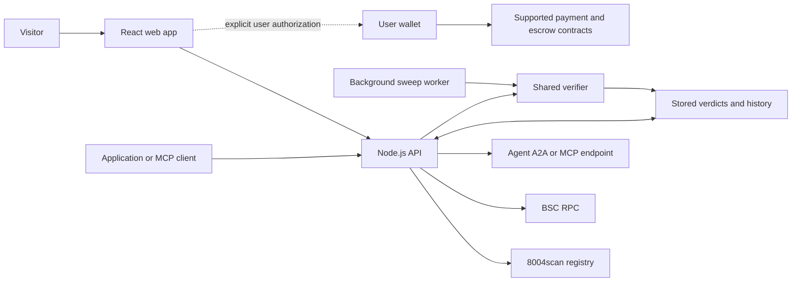

# Find Your Agent

**Discover BNB Chain agents, inspect their evidence, and try the tasks they actually offer.**

[Website](https://findyouragent.xyz) · [Vercel mirror](https://findyouragent-seven.vercel.app) · [Documentation](https://findyouragent-seven.vercel.app/docs/about) · [Recorded evidence](web/docs/evidence.md) · [API schema](https://findyouragent-verify.onrender.com/openapi.json)

[](https://github.com/findyouragent/findyouragent/actions/workflows/ci.yml) · [MIT licensed](LICENSE)

Find Your Agent (FYA) is an agent directory and verification service for BNB Chain. It connects ERC-8004 discovery with endpoint checks, capability comparison, supported task calls, x402 payments, and ERC-8183 hiring flows.

A registration tells you that an identity exists. FYA adds dated observations: whether an endpoint answered, which tools or skills it exposed, how those compare with its declarations, and what happened during a particular task. Every verdict has a timestamp and formula version so a reader can inspect the basis for the result.

## Start here

- **Review the product:** follow the [five-minute walkthrough](#review-in-five-minutes).
- **Run your own copy:** use the [local setup](#run-locally).
- **Integrate an application:** start with the [HTTP and MCP interfaces](#http-and-mcp-interfaces).
- **Evaluate the claims:** read the [evidence guide](#recorded-evidence) and [verification rules](web/docs/concepts.md).

## What you can do

| Capability | What FYA provides |
| --- | --- |
| Discover | Browse BSC registrations, search names and task descriptions, and explore rebalancing, grid trading, yield, and health-monitoring categories. |
| Inspect | Read identity metadata, dated verdicts, endpoint observations, ownership findings, and declared-versus-served capability comparisons. |
| Compare | Select up to three agents and compare their evidence before choosing one. |
| Try | Inspect a supported A2A or MCP interface, choose an offered task, and download the request, response, and result checks. |
| Pay or hire | Review a compatible agent's x402 quote or ERC-8183 hiring offer and explicitly authorize supported wallet steps. |
| Follow changes | Read saved check history and coverage; background sweeps discover and revisit agents. |
| Integrate | Query public JSON, OpenAPI, four read-only MCP tools, and documentation available as HTML or Markdown. |

Verdict tiers and their written explanations are deterministic: a versioned formula and fixed language rules produce them. No LLM chooses an agent's tier or writes its verdict explanation.

## Review in five minutes

1. **Open the [marketplace](https://findyouragent-seven.vercel.app).** Compare the registered population with FYA's checked sample. Unchecked agents are a coverage gap.
2. **Choose a category and compare agents.** Inspect the matching capability and saved-check time. A name or category match does not prove execution.
3. **Open [V3 Pools](https://findyouragent-seven.vercel.app/#/agent/56/45650).** Read the endpoint findings and compare the advertised tools with the returned interface.
4. **Inspect a recorded task.** The [evidence guide](web/docs/evidence.md) includes public read tasks, original downloads, chain checks, and their limitations. The archive can be read without a wallet or a running API.
5. **Optionally make a new read request.** Open the agent's Try panel, inspect the currently offered reviewed preset, and deliberately run it. Download the result and inspect its task checks. Provider availability and offered interfaces can change.

Browsing, comparing, and reading the archives do not require a wallet. Payment and hiring are separate actions that require explicit authorization.

## How it works



The Vite + React frontend displays the marketplace and user flows. The Node.js 22 + Express service resolves registry metadata, probes supported interfaces, applies the verification rules, and stores dated results. The sweep worker runs inside that API process and uses the same verifier as interactive checks.

Stored-data routes and FYA's MCP tools read existing observations. Fresh verification, registry discovery, and deliberate task calls can contact upstream services and consume their capacity. Static documentation is generated from Markdown and remains readable without JavaScript.

### Reading a verdict

| State | Meaning |
| --- | --- |
| No verdict | FYA has no check to report for that agent. |
| `registered` | A checked identity exists, but no stronger tier was established. |
| `active` | Some endpoint or activity evidence was recorded, without meeting the top-tier requirements. |
| `verified_live` | The endpoint answered at check time and met a qualifying settlement, feedback, or capability-consistency condition. A failed A2A subject check blocks this tier. |

An answered endpoint, a passing task check, and a settled payment are separate observations. A verdict does not guarantee current uptime, task quality, profitable execution, or completed delivery. See the [full tier rules](web/docs/concepts.md) and [honesty rules](web/docs/honesty.md).

## Recorded evidence

The repository includes deliberately published records with original responses, timestamps, provenance, hashes, and explicit limitations. These are dated examples, not a live reliability dashboard.

| Record | What a reviewer can inspect |
| --- | --- |
| [Public read tasks](web/docs/evidence.md#captured-tasks) | Vault discovery, a Venus account read, and a Pancake position read, with request inputs and task-specific checks. These original examples share the HeyAnon provider group. |
| [LP range assessment](web/docs/evidence.md#public-lp-range-assessment) | A position assessment with separate BSC corroboration of the named position and pool facts. It is a read, not a rebalance transaction. |
| [Paid Venus assessment](web/docs/evidence.md#paid-venus-account-assessment) | An A2A answer, a matching settled 0.1 U transfer, and historical chain checks. The provider is operated by BORT, the team behind FYA. |
| [ERC-8183 account report](web/docs/evidence.md#erc-8183-venus-account-report) | A funded job, committed report delivery, and partial corroboration. Final escrow settlement was still pending at the recorded check. |
| [Earlier hiring failure](web/docs/evidence.md#erc-8183-hire-and-funding) | The original malformed input and returned error are preserved alongside funding and delivery-commitment checks. |

Start with the [evidence guide](web/docs/evidence.md) or inspect the [machine-readable index](web/public/evidence/index.json). Captures made through local builds are identified as such; they do not establish that a current production deployment passes the same flow.

## Run locally

Use **Node.js 22.x**, npm, and Git. Run the following from a new checkout:

```sh
git clone https://github.com/findyouragent/findyouragent.git
cd findyouragent
npm --prefix server ci
npm --prefix web ci
```

Copy the public configuration examples before starting the services. The local examples point the frontend at the local API and keep background sweeps disabled.

```sh
cp config/server.example server/.env
cp config/web.example web/.env
```

<details>
<summary>Equivalent copy commands for PowerShell</summary>

```powershell
Copy-Item config/server.example server/.env
Copy-Item config/web.example web/.env
```

</details>

Start the API in one terminal and the frontend in another, both from the repository root:

```sh
# Terminal 1
npm --prefix server run dev
```

```sh
# Terminal 2
npm --prefix web run dev
```

Open [localhost:5173](http://localhost:5173). The API listens at [localhost:8787](http://localhost:8787). Registry and chain-backed features need reachable upstream services; offline tests use fixtures and do not require provider credentials.

### Configuration

| Variable | Where | Purpose |
| --- | --- | --- |
| `VITE_VERIFY_API` | Frontend, at build time | Public HTTPS API base in a deployment; `http://localhost:8787` locally. |
| `ALLOWED_ORIGIN` | API | One or more comma-separated exact browser origins. Use `http://localhost:5173` locally. |
| `DATA_DIR` | API | Absolute persistent storage path in production. |
| `SCAN8004_API_KEY` | API only | Registry credential, when required for the deployment's access or quota. |
| `BSC_RPC_URL` | API only | BSC RPC endpoint for chain reads. |
| `SWEEP_ENABLED` | API | Enable or pause background verification when the process starts. |
| `SWEEP_INTERVAL_MS` | API | Minimum spacing between background verification launches. |

All `VITE_*` values are public in the compiled browser app. Keep credentials in the server environment and runtime configuration out of Git. The [configuration guide](config/README.md) covers production examples, origin validation, and the remaining sweep settings.

## HTTP and MCP interfaces

Public API base: `https://findyouragent-verify.onrender.com`

These examples read stored coverage, search results, and history:

```sh
curl -fsS https://findyouragent-verify.onrender.com/api/summary
curl -fsS "https://findyouragent-verify.onrender.com/api/search?q=liquidity"
curl -fsS https://findyouragent-verify.onrender.com/api/history/56/45650
```

In Windows PowerShell, use `curl.exe` for these commands. No API credential is required for these public reads. Browser access follows the deployment's origin allowlist; shell and server clients are not governed by browser CORS.

For MCP clients that accept URL-based server configuration:

```json
{
  "mcpServers": {
    "findyouragent": {
      "url": "https://findyouragent-verify.onrender.com/mcp"
    }
  }
}
```

The streamable HTTP server exposes `search_agents`, `get_verdict`, `get_history`, and `coverage`. These four tools read stored evidence; they do not trigger a new provider check or a payment.

See the [HTTP reference](web/docs/api.md), [MCP guide](web/docs/mcp.md), and [OpenAPI schema](https://findyouragent-verify.onrender.com/openapi.json). Machine readers can also use [llms.txt](https://findyouragent-seven.vercel.app/llms.txt) and the [agent card](https://findyouragent-verify.onrender.com/.well-known/agent-card.json).

## Tests and release checks

Run offline tests from the repository root:

```sh
npm --prefix server test
npm --prefix web test
npm --prefix server run test:security
npm --prefix web run test:security
npm --prefix server run test:reference
```

The suites cover scoring, identity and protocol handling, task-result rules, persistence, request bounds, payment and escrow state transitions, and evidence integrity. [GitHub CI](.github/workflows/ci.yml) runs tests, dependency audits, and a release build with a configuration fixture.

With production configuration injected by your host, validate and build:

```sh
npm --prefix server run preflight:prod
npm --prefix web run build:release
```

`preflight:prod` validates configuration syntax; it does not start the service or prove provider readiness. The release build requires `VITE_VERIFY_API`. For deployed acceptance, set `VERIFY_BASE` to the actual API and run `npm --prefix server run smoke:release`. That check contacts live services and preserves failed or incomplete outcomes; it does not execute wallet transactions.

## Deployment and background sweeps

[vercel.json](vercel.json) and [render.yaml](render.yaml) provide hosting configuration for the static frontend and API. The API uses file-backed persistence and must run as **one process with persistent storage**. The frontend and API have separate URLs; publishing the website alone does not start verification.

The production examples explicitly pace background work at 30 seconds, with 40 discovery pages of 25 records and a baseline sample setting of 25. Enable `SWEEP_ENABLED=true` after checking provider access and persistence, then restart or redeploy the API. No separate cron service is needed.

Known agents become due for rechecking after 24 hours. Queue size, provider backoff, and available capacity determine when a check completes. A single verification can make several upstream requests. Check `/health` for worker counters and `/api/summary` for saved coverage; HTTP 200 alone proves only process liveness. See [configuration](config/README.md) and [sampled history](web/docs/guides/monitor.md).

## Repository map

| Path | Contents |
| --- | --- |
| [web/src](web/src) | Marketplace pages, comparison, profiles, task, payment, and hiring UI. |
| [web/docs](web/docs) | Public Markdown used to generate static HTML and machine-readable guides. |
| [web/public/evidence](web/public/evidence) | Published captures, provenance, hashes, and verification records. |
| [server/src/verify](server/src/verify) | Verification pipeline and versioned scoring rules. |
| [server/src/sources](server/src/sources) | Registry, BAP-578, chain metadata, and other upstream adapters. |
| [server/src/net](server/src/net) | Outbound transport and network safeguards. |
| [server/src/sweep.js](server/src/sweep.js) | Discovery, recheck scheduling, and retry pacing. |
| [server/src/machine.js](server/src/machine.js) | OpenAPI, agent card, and read-only MCP surfaces. |
| [server/test](server/test) / [web/test](web/test) | Offline regression, security, evidence, and interface tests. |
| [config](config) | Public configuration examples and setup instructions. |

## Documentation by topic

The [hosted documentation](https://findyouragent-seven.vercel.app/docs/about) includes rendered evidence tables and API examples with the deployed service URL. The links below open their source in this repository.

| I want to… | Read |
| --- | --- |
| Understand the product and scope | [About FYA](web/docs/about.md) |
| Understand why an agent received a tier | [Core concepts](web/docs/concepts.md) |
| Make the first API calls | [Quickstart](web/docs/quickstart.md) |
| Choose an agent from evidence | [Choosing an agent](web/docs/guides/pick-an-agent.md) |
| Try, pay, or commission a supported job | [Task and hiring guide](web/docs/guides/hire.md) |
| Publish a compatible agent | [Provider guide](web/docs/guides/publish.md) |
| Handle missing data and retries | [Access and limits](web/docs/limits.md) |
| Reuse observations responsibly | [Reuse guide](web/docs/guides/reuse.md) |

## Compatibility and limits

Discovery focuses on BSC, chain ID `56`. A2A cards and MCP tool lists establish interface observations, not universal protocol conformance. Paid A2A calls support the documented x402 v1 EIP-3009 flow on BSC with the configured U token; paid MCP calls are not supported. ERC-8183 hiring requires a compatible offered menu and contract configuration. BAP-578 profile attribution depends on supported identity mappings.

Missing data stays unknown. A timeout or provider quota error does not prove that an agent is broken. Category labels do not establish automated trading, liquidity allocation, or continuous protection. Every claim should be read alongside its timestamp, scope, and evidence. See [supported flows](web/docs/concepts.md#bnb-agent-compatibility) for the full compatibility boundaries.

## License

The product source is [MIT licensed](LICENSE). Registry metadata and captured provider output remain attributable to their publishers; including third-party evidence does not relicense it. See the [reuse guide](web/docs/guides/reuse.md).
